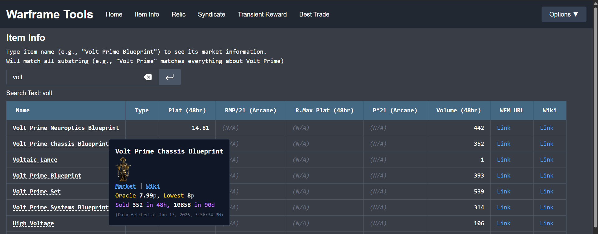

# Web GUI

A web version GUI for roughly the same tasks, but with more interactability



> **Video Demo (Youtube)**
> 
> [](https://www.youtube.com/watch?v=AZY_MeDa9XM)

## Functionality

More information could be found in the [homepage](https://kaiserouo.github.io/Warframe-Tools/).
```
Function:
    - Item Info: Show item market information on warframe.market. Can search multiple items at once.
    - Relic: Calculate expected plat reward for relics.
    - Syndicate: Show syndicate item information and market prices.
    - Transient Reward: Show transient reward item information and market prices.
    - Find Best Trade: For a list of items you want to buy, find the best buyers to buy from.
    - Inventory: Inventory related functionalities.
        - Riven: Riven viewer with advanced sorting and filtering.
        - Missing Item Checklist: Check missing items from all sorts of farms.
        - Loadout: Loadout viewer for all items in inventory.
        - Relic: Find items in relic to make sets.
        - JSON Viewer: View raw inventory JSON file.
```

## Docker

There is a docker compose file for localhost usage.
```bash
# in the repo folder (Warframe-Tools/)
docker compose up -d
```

The website will be on `http://localhost:5000`.

Note that this only supports localhost. If you intend to host this on other server, refer to the *HTTPS* section below.

> Do **NOT** follow the *Non-Localhost Server* section: docker already expose the website to localhost, and you don't need to care about `config.py`. You only need to let a production web server reverse proxy the request to `http://localhost:5000`.

## Manual Installation

```bash
# we use conda here, ref. https://www.anaconda.com/docs/getting-started/miniconda/install
conda create --name warframe python=3.12
conda activate warframe

# install packages
pip install -r requirement.txt

# we use node.js, ref. https://nodejs.org/en/download
# note that we use the newest version, versions too old wouldn't be able to run
cd Warframe-Tool/src/web/frontend
npm install

# if it complains that it lacks packages etc:
npm ci

# install xvfb, ref. src/data/inventory/overframe.md: Overframe > Data > Data Fetching > Webpack Fetching
sudo apt-get install -y xvfb
```

### Development

To do development, you need a frontend vite server and a backend python flask server:
```bash
# start developer frontend server
cd Warframe-Tool/src/web/frontend
npm start

# in another terminal, run the API server
cd Warframe-Tool
python -m src.web.backend.server

# ALTERNATIVELY, there's a script that sets up tmux
# to run the above 2 commands in a tmux window
cd Warframe-Tool
bash dev_tmux.sh
```

The URL should be something like `http://localhost:5173` (vite default URL).
We use vite, and you can change the code and restart the server with the new code by typing `r` in the vite terminal.

### Deployment

To deploy, build the frontend and use the python flask server to serve as API server as well as frontend server:
```bash
# in one terminal, run the API server
cd Warframe-Tool    # at the repo folder
conda activate warframe
python -m src.web.backend.server

# in another terminal, build the frontend website
# the built code should be in web/frontend/build, and will be also served by the API server
cd Warframe-Tool/web/frontend
npm build

# ALTERNATIVELY, there's a script that sets up tmux
# to run the above 2 commands in a tmux window
cd Warframe-Tool
bash prod_tmux.sh
```

The flask server also hosts the files in `src/web/frontend/build`, the URL should be something like `http://localhost:5000` (flask default URL).

Note that the server should be hosted on `localhost`, since this is a development flask server, with service that's very easily DoS-ed, and generally shouldn't be exposed. Even without these issues, warframe market API request-per-second limitation also limits the potential of this server being used by multiple people. **Please host your own server (`python -m src.web.backend.server`) if you wanna use this, and DON'T EXPOSE THIS SERVER TO PUBLIC.**

> #### Non-Localhost Server
> If you do wanna host it on a different computer, please put your server under VPN or use other tactics to access the server without exposing the server to public. Remember to manually change the IP of the flask server in `server.py` to your VPN IP instead, OR, write the setting to `config.py` and the server will use that instead:
> ```bash
> # change to your own IP and port, DEBUG toggles the debug mode for Flask
> echo "DEBUG, HOST, PORT = False, 'localhost', 5000" > src/web/backend/config.py    
> ```

> #### IPv6 Disable
> For reasons unknown, if you use IPv6 to request api.warframe.market, it would hang after the server runs for a while. We need to make sure python request doesn't use IPv6.
> 
> There is no clean way to do so. Disabling IPv6 for the whole system is the solution that works for me.
> ```bash
> # to automatically disable ipv6 after startup:
> sudo nano /etc/sysctl.d/99-disable-ipv6.conf
> 
> # type the following into the config file
> net.ipv6.conf.all.disable_ipv6 = 1
> net.ipv6.conf.default.disable_ipv6 = 1
> 
> # back in terminal
> sudo sysctl --system  # apply immediately
> ``` 

> #### HTTPS
> For the inventory file related functionality, we need the built-in crypto library for the decryption of `lastData.dat`, which is only available if (1) you host the server on localhost `http://localhost:<port>` or (2) you host it on another computer but you have HTTPS enabled `https://<addr>:<port>`.
> 
> If you are hosting it on a different computer, please use reverse proxy with a production web server (e.g., nginx, apache) with a self-signed certificate (at least) to make the website HTTPS enabled.
> 
> For example, if the host has IP `<VPN_IP_ADDR>`, uses apache server, have a self-signed certificate, have the python server run on localhost port 5000 and want to have the reverse proxy on port 6001 (note that you can't use the [unsafe ports defined by chromium](https://superuser.com/questions/188058/which-ports-are-considered-unsafe-by-chrome)), your site-enabled file should have something like:
> ```
> <VirtualHost *:6001>
>    ServerName <VPN_IP_ADDR>
>    DocumentRoot /var/www/html
> 
>    SSLEngine on
>    SSLCertificateFile /etc/ssl/certs/apache-selfsigned.crt
>    SSLCertificateKeyFile /etc/ssl/private/apache-selfsigned.key
> 
>    ProxyPass / http://localhost:5000/
>    ProxyPassReverse / http://localhost:5000/
>    ProxyRequests Off
> </VirtualHost>
> ```
> and you should be connected via `https://<VPN_IP_ADDR>:6001/`

## Note

### Overframe Data

> ref. `src/data/inventory/overframe.md`

To get overframe data automatically, we need to use non-headless Selenium to get the webpack nonce.
This is not possible in two cases:
- In github actions, cloudflare blocks this method.
- In architectures in which chromium isn't available (e.g., aarch64, i.e., on raspberry pi).

This can be mitigated by manually entering the nonce in `src/data/inventory/overframe_link.py`.
Make sure to update it manually if you want overframe related functionalities (e.g., Inventory > Loadout page). Refer to that python file for instructions.

> If you have a [remote webdriver](https://www.selenium.dev/documentation/webdriver/drivers/remote_webdriver/) that can get around the constraints (e.g., use [a docker container](https://hub.docker.com/r/selenium/standalone-chromium)), you can let the python flask server use that instead of invoking xvfb + selenium on the server itself:
> ```bash
> # you can change the remote URL of the remote webdriver
> echo "OVERFRAME_GET_WEBPAGE_MODE, OVERFRAME_GET_WEBPAGE_REMOTE_URL = 'remote', 'http://selenium:4444'" > src/web/backend/config.py    
> ```