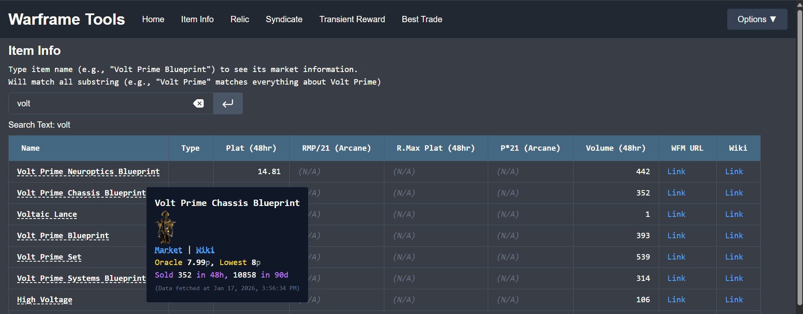

# Web GUI

A web version GUI for roughly the same tasks, but with more interactability



## Functionality

More information could be found in the server homepage
```
Function:
    - Item Info: Show item information and market prices on warframe.market. Can search multiple items at once.
    - Relic: Gives expected plat reward for relics.
    - Syndicate: Show item information and market prices sold by the syndicate.
    - Transient Reward: Show item information and market prices sold of transient rewards.
    - Find Best Trade: For a list of items, find the best users to trade with to minimize total price deviation from oracle price. (also serves as mass query for multiple items' current market prices & best to buy item currently)
    - Riven: Riven Viewer
```

## Install

```bash
# we use conda here, ref. https://www.anaconda.com/docs/getting-started/miniconda/install
conda create --name warframe python=3.12
conda activate warframe

# install packages
pip install -r requirement.txt

# we use node.js, ref. https://nodejs.org/en/download
# note that we use the newest version, versions too old wouldn't be able to run
cd Warframe-Tool/src/web/frontend
npm install

# if it complains that it doesn't have vite:
npm install vite @vitejs/plugin-react --save-dev
```


### Docker

You can also use docker compose to run the app:
> TODO: make a docker compose file for this

### Build & Run
To build the frontend:
```bash
# in one terminal, run the API server
cd Warframe-Tool    # at the repo folder
conda activate warframe
python -m src.web.backend.server

# in another terminal, build the frontend website
# the built code should be in web/frontend/build
cd Warframe-Tool/web/frontend
npm build

# ALTERNATIVELY, there's a script that sets up tmux
# to run the above 2 commands in a tmux window
cd Warframe-Tool
bash prod_tmux.sh
```

The flask server also hosts the files in `src/web/frontend/build`, the URL should be something like `http://localhost:5000` (flask default URL).

Note that the server should be hosted on `localhost`, since this is a development flask server, with service that's very easily DoS-ed, and generally shouldn't be exposed. Even without these issues, warframe market API request-per-second limitation also limits the potential of this server being used by multiple people. **Please host your own server (`python -m src.web.backend.server`) if you wanna use this, and DON'T EXPOSE THIS SERVER TO PUBLIC.**

> If you do wanna host it on a different computer, please put your server under VPN or use other tactics to access the server without exposing the server to public. Remember to manually change the IP of the flask server in `server.py` to your VPN IP instead, OR, write the setting to `config.py` and the server will use that instead:
> ```bash
> # change to your own IP and port, DEBUG toggles the debug mode for Flask
> echo "DEBUG, HOST, PORT = False, 'localhost', 5000" > src/web/backend/config.py    
> ```

> For reasons unknown, if you use IPv6 to request api.warframe.market, it would hang after the server runs for a while. We need to make sure python request doesn't use IPv6.
> 
> There is no clean way to do so. Disabling IPv6 for the whole system is the solution that works for me.
> ```bash
> # to automatically disable ipv6 after startup:
> sudo nano /etc/sysctl.d/99-disable-ipv6.conf
> 
> # type the following into the config file
> net.ipv6.conf.all.disable_ipv6 = 1
> net.ipv6.conf.default.disable_ipv6 = 1
> 
> # back in terminal
> sudo sysctl --system  # apply immediately
> ``` 

> For the inventory file related functionality (e.g., the Riven page. most notably the decryption of `lastData.dat`), we need the built-in crypto library, which is only available if (1) you host the server on localhost `http://localhost:<port>` or (2) you host it on another computer but you have HTTPS enabled `https://<addr>:<port>`.
> 
> If you are hosting it on a different computer, please use reverse proxy with a production web server (e.g., nginx, apache) with a self-signed certificate (at least) to make the website HTTPS enabled.
> 
> For example, if the host has IP `<VPN_IP_ADDR>`, uses apache server, have a self-signed certificate, have the python server run on localhost port 5000 and want to have the reverse proxy on port 6001 (note that you can't use the [unsafe ports defined by chromium](https://superuser.com/questions/188058/which-ports-are-considered-unsafe-by-chrome)), your site-enabled file should have something like:
> ```
> <VirtualHost *:6001>
>    ServerName <VPN_IP_ADDR>
>    DocumentRoot /var/www/html
> 
>    SSLEngine on
>    SSLCertificateFile /etc/ssl/certs/apache-selfsigned.crt
>    SSLCertificateKeyFile /etc/ssl/private/apache-selfsigned.key
> 
>    ProxyPass / http://localhost:5000/
>    ProxyPassReverse / http://localhost:5000/
>    ProxyRequests Off
> </VirtualHost>
> ```
> and you should be connected via `https://<VPN_IP_ADDR>:6001/`

### Develop

To run the server, you need node.js and related packages:
```bash
# start developer frontend server
cd Warframe-Tool/src/web/frontend
npm start

# in another terminal, run the API server
cd Warframe-Tool
python -m src.web.backend.server

# ALTERNATIVELY, there's a script that sets up tmux
# to run the above 2 commands in a tmux window
cd Warframe-Tool
bash dev_tmux.sh
```

The URL should be something like `http://localhost:5173` (vite default URL).
We use vite, and you can change the code and restart the server with the new code by typing `r` in the vite terminal.