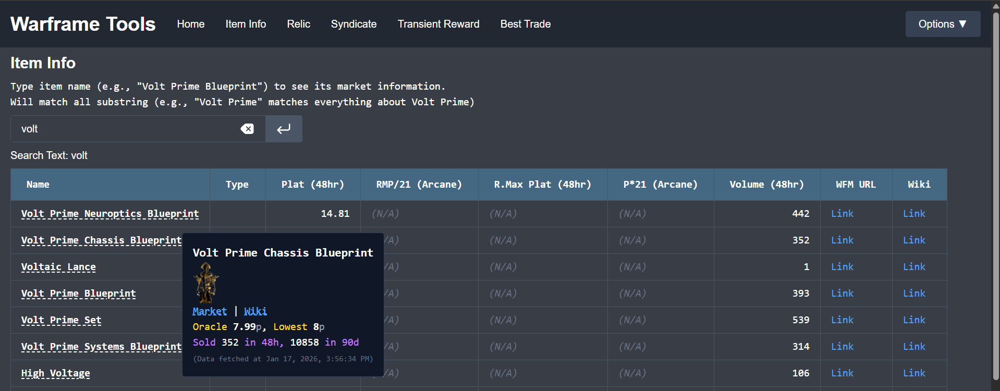

# Web GUI

A web version GUI for roughly the same tasks, but with more interactability



## Functionality

More information could be found in the server homepage
```
Function:
    - Item Info: Show item information and market prices on warframe.market. Can search multiple items at once.
    - Relic: Gives expected plat reward for relics.
    - Syndicate: Show item information and market prices sold by the syndicate.
    - Transient Reward: Show item information and market prices sold of transient rewards.
    - Find Best Trade: For a list of items, find the best users to trade with to minimize total price deviation from oracle price. (also serves as mass query for multiple items' current market prices & best to buy item currently)
```

## Run

### Docker

You can use docker compose to run the app:
> TODO: make a docker compose file for this

### Build & Run
To build the frontend:
```bash
# in one terminal, run the API server
cd warframe-cli
python server.py

# in another terminal, build the frontend website
# the built code should be in web/frontend/build
cd warframe-cli/web/frontend
npm build
```

The flask server also hosts the files in `web/frontend/build`, the URL should be something like `http://localhost:5000` (flask default URL).

Note that the server should be hosted on `localhost`, since this is a development flask server, with service that's very easily DoS-ed, and generally shouldn't be exposed. Even without these issues, warframe market API request-per-second limitation also limits the potential of this server being used by multiple people. **Please host your own server (`python server.py`) if you wanna use this, and DON'T EXPOSE THIS SERVER TO PUBLIC.**

> If you do wanna host it on a different computer, please put your server under VPN or use other tactics to access the server without exposing the server to public. Remember to manually change the IP of the flask server in `server.py` to your VPN IP instead.

### Develop

To run the server, you need node.js and related packages:
```bash
# start developer frontend server
cd web/frontend
npm start

# in another terminal, run the API server
python server.py
```

The URL should be something like `http://localhost:5173` (vite default URL).
We use vite, and you can change the code and restart the server with the new code by typing `r` in the vite terminal.